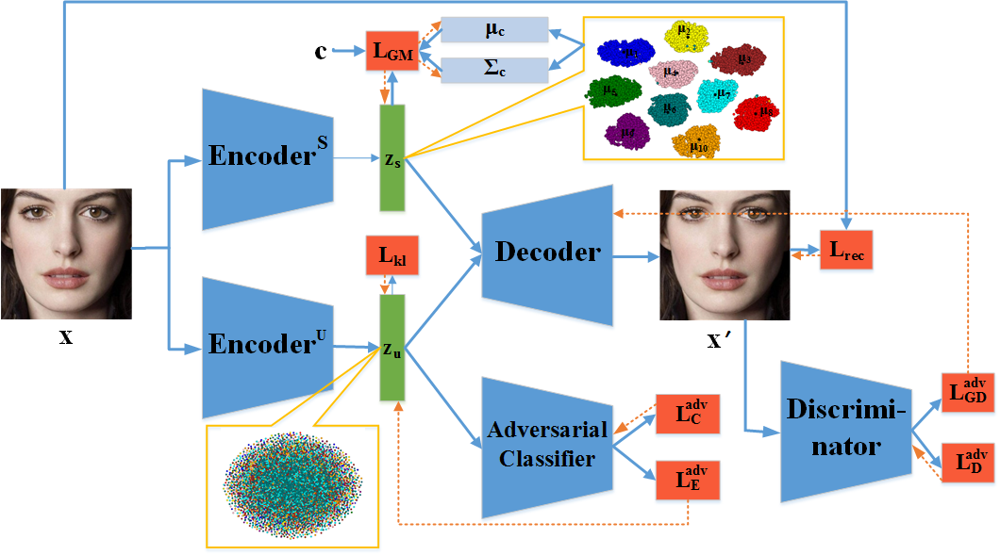
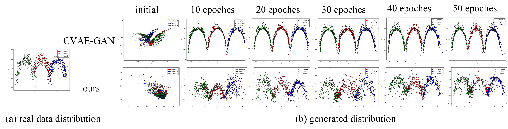

# Lr-LiVAE (CVPR2019)
Tensorflow implementation of [**Disentangling Latent Space for VAE by Label Relevant/Irrelevant Dimensions**] (https://arxiv.org/abs/1812.09502v4).

**The network architecture**
<p align="center"> <br><center></center></p>

## Exemplar Results
- Toy experiment
<p align="center"> <br><center></center></p>

- Generated images
<p align="center"> <br><center></center></p>

- Face synthesis
<p align="center"> <br><center></center></p>

## Preparation

- **Prerequisites**
    - Tensorflow 
    - Python 2.x with matplotlib, numpy and scipy
- **Dataset**
    - [FaceScrub](http://vintage.winklerbros.net/facescrub.html)
        - Images should be placed in Datas/facescrub_aligned/
- **pre-trained model**
    - Download the trained model from           and unzip the files to ***./models/***
## Quick Start

Exemplar commands are listed here for a quick start.

### Training
    ```console
    python Lr-LiVAE-GAN-face.py --mode training
    ```
### Testing
- Example of generating random samples
    ```console
    python Lr-LiVAE-GAN-face.py --mode generation
    ```
- Example of image inpainting
    ```console
    python Lr-LiVAE-GAN-face.py --mode inpainting
    ```
- Example of face synthesis using z_s and z_u from different images
    ```console
    python Lr-LiVAE-GAN-face.py --mode exchanging
    ```
## Citation
If this work is useful for your research, please consider citing:
    @inproceedings{zheng2019disentangling,
      title={Disentangling Latent Space for VAE by Label Relevant/Irrelevant Dimensions},
      author={Zheng, Zhilin and Sun, Li},
      booktitle={Proceedings of the IEEE Conference on Computer Vision and Pattern Recognition},
      pages={12192--12201},
      year={2019}
    }


